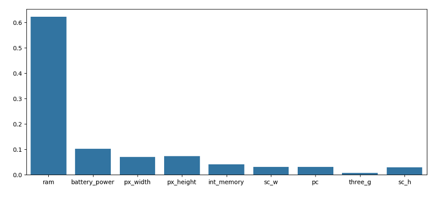
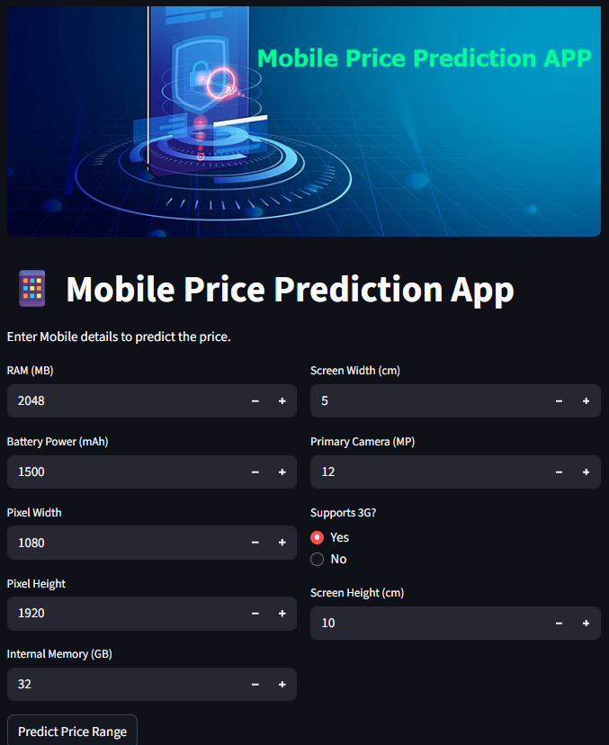

# Mobile Phone Price Prediction using Machine learning.

## How to Access the mobile pridiction of app using below link.
Click one below link.

Note: if app is sleeping. Please click on `Yes, Get this app back up`

app: https://project2-predict-mobile-phone-pricing.streamlit.app/ 

## Project Overview
The objective of this project is to build a **machine learning classification system** that predicts the **price range of a mobile phone** based on its specifications and features.  

The model classifies mobile phones into one of the following price categories:
- **0** → Low Cost  
- **1** → Medium Cost  
- **2** → High Cost  
- **3** → Very High Cost  
This project focuses on **data exploration, feature understanding, model building, and evaluation**.

## Problem Statement
Given a dataset containing technical specifications of mobile phones (battery, RAM, camera, connectivity, etc.), predict the **price range** of a mobile phone.

This is a **multi-class classification problem**.

## Dataset Description
The dataset consists of **mobile phone features** and a target variable `price_range`.
Dataset Download: https://github.com/Kumard8x/Project_2_Predict_mobile_phone_pricing/blob/main/dataset.csv


## Feature Details
This dataset contains data on various mobiles phones, their features, and pricing.

### Target Variable
Price Range:
- 0 : Low Cost
- 1 : Medium Cost
- 2 : High Cost
- 3 : Very High Cost

## Approach & Methodology

1. **Data Understanding & Exploration**
2. **Data Preprocessing**
3. **Model Building**
   - Random Forest Classifier
   
4. **Model Evaluation**
   - Accuracy Score
   - Confusion Matrix
   - Classification Report

5. **Model Performance**
    - Random Forest Classifier with accuracy of 91%

## Technology used:
- **Programming Language**: Python  
- **Libraries Used**:
  - NumPy
  - Pandas
  - Matplotlib
  - Seaborn
  - Scikit-learn

## How to Run the Project

1. Clone the repository:
```bash
git clone https://github.com/Kumard8x/Project_2_Predict_mobile_phone_pricing.git
```

2. Install dependencies:
```bash
pip install -r requirements.txt
```

3. Run the notebook or Python scripts to train and evaluate the model.
```bash
streamlit run srcipt.py
```


## Results
- Achieved high accuracy in predicting mobile price ranges.
- **RAM, battery power, pixel resolution, internal memory, screen size, camera and 3G device** were among the most influential features.


## Conclusion
This project demonstrates how mobile phone specifications can effectively predict price categories using machine learning techniques.

## Snapshot:


